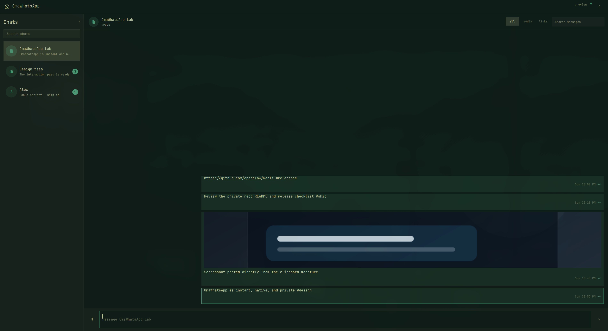
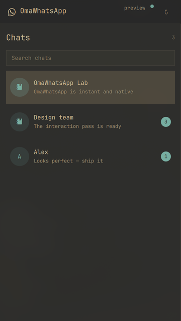
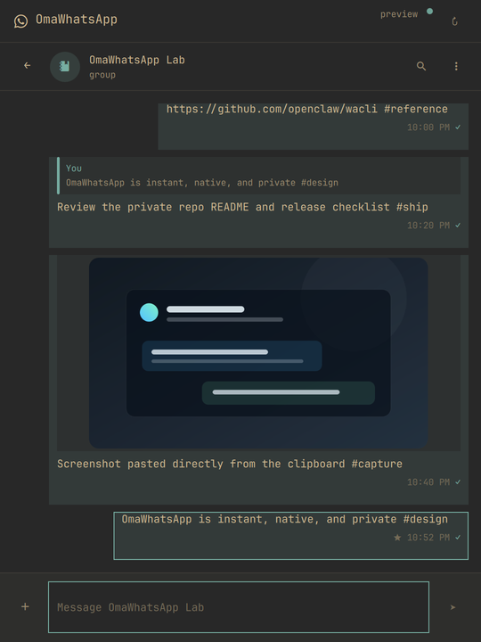
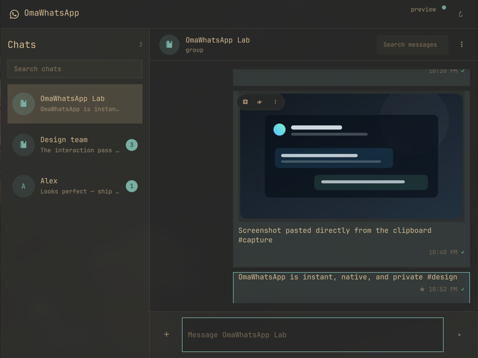
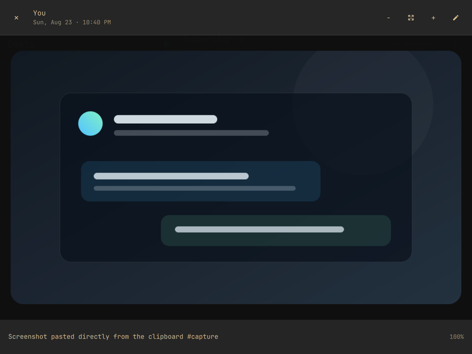
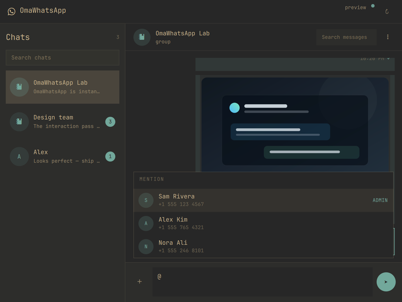

# OmaWhatsApp

**WhatsApp in Quickshell—not Chromium.**

OmaWhatsApp is a fast, local-first WhatsApp client made for Omarchy. It renders
the private mirror maintained by [`wacli`](https://github.com/openclaw/wacli),
opens without waiting on the network, and follows the active Omarchy theme. No
Electron runtime, browser wrapper, or cloud backend is added.

## Why this exists

WhatsApp Web can feel slow and janky on the desktop, and it does not follow
Omarchy themes. OmaWhatsApp exists to make everyday chats feel immediate,
native, and visually at home in Omarchy.



## A WhatsApp client that feels like Omarchy

- **Local-first opening.** Chats and messages render from SQLite immediately;
  network sync continues in a quiet user service.
- **Change-driven refresh.** A tiny resident filesystem watcher debounces
  SQLite/WAL changes, so new messages appear immediately without hot polling.
- **A real offline switch.** Pause and disable background sync from the header;
  the complete local archive remains searchable and readable.
- **Receipts stay deliberate.** Opening a chat or dismissing its badge is local
  only. `Mark read · send receipt` is the explicit WhatsApp write.
- **One native plugin.** The service, panel, and configurable bar item share a
  single Omarchy plugin lifecycle.
- **No duplicate sync process.** Sends use wacli's live companion path and a
  serialized fallback only when its store is locked.
- **Responsive by design.** Wide, compact, narrow, and 360 px layouts are real
  layouts—not a clipped desktop view.
- **Theme-native.** Colors, typography, spacing, hover states, and focus come
  from the active Omarchy theme.
- **Keyboard-native.** Jump between chats, collapse the rail, search, attach,
  reply, and open media without leaving the keyboard.
- **Agent-native.** The installer ships a shared `$omawhatsapp` skill so an
  on-device Omarchy agent can search your local archive or carry out a clearly
  requested WhatsApp action through the same guarded helper as the UI.

## Everyday conversation flow

- Browse every locally synced direct message and group; search chats or the
  current conversation.
- Send multiline text, replies, edits, reactions, interactive options, polls,
  stickers, and up to 10 files with a caption.
- Type `@` in a group for a filtered member picker; OmaWhatsApp sends a real
  WhatsApp mention rather than decorative text.
- Paste text, screenshots, GIFs, or local files; drag files into the window;
  review and remove attachments before sending.
- A multi-photo selection stays one action and renders as a responsive album;
  its real WhatsApp media-message IDs remain intact underneath.
- Render images, stickers, animated GIFs, WhatsApp's looping-video GIFs,
  videos, voice/audio messages, documents, locations, quotes, reactions,
  edited/forwarded/starred state, and button rows.
- Open photos, GIFs, and videos in a full-window native gallery with fit/zoom,
  previous/next navigation, playback, metadata, and external-open controls.
- When [`Omasnap`](https://github.com/tobi/omasnap) is installed, Open
  externally sends images straight into its native annotation editor; other
  media and systems fall back to the desktop's default viewer.
- Drag across message text to copy it automatically, or use Copy from the
  message menu; a small confirmation toast appears. Reply, edit, forward,
  delete for you, and delete for everyone share the same action surface.
- Keep a separate draft, reply/edit context, and pending attachment queue for
  every chat while switching between conversations.
- Get a quiet bar badge without persistent desktop popups. Opening a chat
  acknowledges that chat locally; middle-clicking the bar dismisses the current
  batch. New incoming messages light it up again, while muted and archived
  chats remain readable without raising the bar badge.

The focused first release contains direct chats and standalone groups only.
Channels/newsletters, calls, Community parents, and Community-linked subgroups
remain untouched in wacli's local mirror and can be added later as deliberate
top-level sections.

Missing media is downloaded only after you ask for it. The helper verifies the
chat and message against the local mirror before any wacli write crosses the
boundary.

## Let your Omarchy agent use WhatsApp

Installation also places the repository-owned skill at
`~/.agents/skills/omawhatsapp`. Compatible agents can use `$omawhatsapp` to
search or summarize local chats and, when you explicitly ask, send, reply,
attach, react, mark read, or manage a chat on your behalf.

The skill is local-first and fail-closed: it never invents recipients, writes
WhatsApp databases directly, treats opening a chat as a receipt, turns offline
mode off by itself, or creates test messages. Every destination must first
resolve to one exact DM or standalone group already present in the local
OmaWhatsApp index.

## One app at every size

| 360 × 640 | 540 × 720 |
|---|---|
| Single-pane mobile flow | Focused narrow conversation |
|  |  |

| 800 × 600 | Native media viewer |
|---|---|
| Compact two-pane layout | Photos, GIFs, and video without leaving the app |
|  |  |

### Real group mentions



All screenshots use repository-owned demo data. No real conversation is
included in this repository.

## Architecture

```text
Super+Shift+W / bar item
          │
          ▼
 disposable QML panel ◄── resident QML service
          │                   │        │
          │                   │        └── debounced SQLite/WAL watcher
          ├── read-only SQLite ◄── wacli sync --follow ◄── WhatsApp
          └── bounded helper ─────► live companion / wacli CLI
```

The window performs no network request when it opens. The bar does not start a
poller, and closing the panel does not throw away the warm chat rail. See
[technical notes](docs/TECHNICAL.md) and the [parity contract](docs/PARITY.md).

## Add it to Omarchy

Requirements:

- Omarchy with the plugin-capable Quickshell shell
- `wacli` 0.17.1 or newer at `~/.local/bin/wacli`
- Qt Multimedia and Image Formats, `wl-clipboard`, `zenity`, `inotify-tools`,
  `jq`, Python 3, and systemd user services

```bash
git clone https://github.com/MoizIbnYousaf/Omarchy-Whatsapp.git && \
  cd Omarchy-Whatsapp && ./scripts/install
```

Link this machine once when needed:

```bash
~/.local/bin/omawhatsapp auth
```

Run `./scripts/install --check` for a read-only installation preflight. A real
install validates and stages the complete plugin tree before replacing it,
installs the shared agent skill, restarts Quickshell once, and enables hardened
background sync. It never copies a WhatsApp session into the repository.

Add the `Super+Shift+W` binding from
[`omarchy/bindings.lua.example`](omarchy/bindings.lua.example).

## Controls

| Input | Action |
|---|---|
| `Super+Shift+W` | Open or close OmaWhatsApp |
| `Ctrl+F` | Find in the current conversation |
| `Ctrl+1` … `Ctrl+9` | Jump to that visible chat (search order respected) |
| `Ctrl+B` | Collapse or restore the chat rail without losing context |
| `C` | Focus the composer |
| `Enter` / `Shift+Enter` | Send / add a line |
| `@`, then arrows + `Enter` | Find and mention a group member |
| `Ctrl+V` | Stage clipboard text, image, GIF, or local file |
| `Ctrl+O` | Add documents |
| `Ctrl+Shift+O` | Add photos and videos |
| `J` / `K`, arrows | Move through messages or the focused chat list |
| `Enter` | Open the selected chat from the chat list |
| `C` | Focus the message composer |
| `Space` | Open selected media; play/pause inside the viewer |
| `Left` / `Right` | Previous/next gallery item |
| `+` / `-` / `0` | Zoom in/out/fit |
| `Esc` | Step back: composer → messages → chat list → close |
| Header `online` / `offline` pill | Toggle background sync; local history stays available |
| Chat menu `Mark read · send receipt` | Explicitly mark the chat read on WhatsApp |

Middle-click the bar item to dismiss the current local notification batch;
right-click refreshes. Neither action sends a read receipt. The widget setting
can hide the notification badge entirely.

## Release quality

```bash
./scripts/test
```

The release gate runs 46 backend boundary/write-path tests, 10 offscreen QML
tests, an isolated installer preflight, manifest validation, QML lint, shell
syntax checks, a diff check, and a heavyweight-runtime dependency guard.
Installed verification and screenshot rules live in [testing](docs/TESTING.md);
the architecture and privacy boundaries are documented alongside the code.

## Remove

```bash
./scripts/uninstall
```

This preserves the linked WhatsApp device and wacli message store. Add
`--purge-runtime` only to remove OmaWhatsApp's own disposable state.

## Project boundary

OmaWhatsApp is a general client. It contains no special chat name, personal
workflow assumption, or user identifier.

OmaWhatsApp is independent and is not affiliated with WhatsApp or Meta.

## License

MIT © 2026 MoizIbnYousaf. See the focused
[third-party notices](THIRD_PARTY_NOTICES.md).
